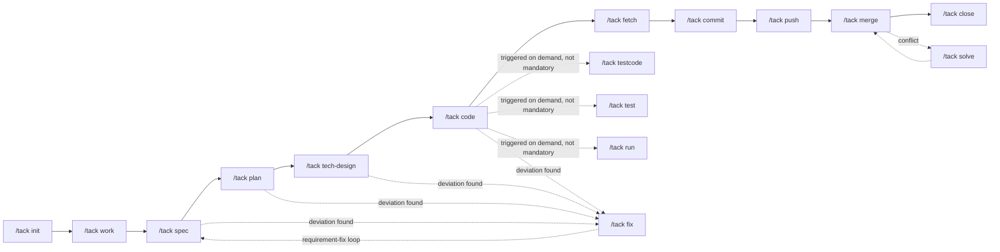

# [Tack Harness](https://github.com/frcoder-lh/tack-harness)

**Minimal & restrained · Human-readable · Fully configurable** — A programming workflow framework built for software R&D

English | [简体中文](README.md)

[](https://github.com/frcoder-lh/tack-harness)


## 1. Introduction

Tack Harness is a programming workflow framework purpose-built for software R&D:

- Along the time dimension it follows the software engineering lifecycle; along the space dimension it organizes the directory structure around development habits;
- It wraps Git operations and supports worktrees, allowing multiple agents to develop different requirements in parallel;
- It standardizes the AI development process, crystallizes shared development logic, centrally shares context, and reduces token consumption.

Both small and large projects can benefit from it.

Unlike existing AI coding tools that hard-code the process, Tack Harness follows these design principles:

| Principle | Description |
| --- | --- |
| **Fixable process** | Anything a script can do never relies on the LLM; fixed-flow scripts guarantee stability and keep token costs under control |
| **Extensible capabilities** | Adding one Markdown file registers one new capability—no changes to the skill itself |
| **Traceable state** | The workspace's `status.yaml` is the single stateful file, so the AI always knows the current progress and the next action |
| **Isolated changes** | Worktrees isolate code changes per requirement; the main repository always stays a read-only baseline |
| **Distilled experience** | Every completed task automatically crystallizes practical experience into commands, workflows, rules, or wiki entries |

Core features:

| Feature | Description |
| --- | --- |
| **Dependency injection** | The skill is the container and capabilities are injections: the skill itself is minimal and contains no command implementations; commands, workflows, and delegatable roles are all Markdown files inside the project—the front matter (command/short/triggers/summary) is the injection declaration, and `scan-routes` dynamically scans and assembles them into a route table at runtime. Adding one file injects one new capability: zero skill changes, and upgrades never overwrite it |
| **Workflow state machine** | Development, testing, bugfix, conflict merge, and branch operations each have an independent workflow defining state transitions and orchestrating commands. The state in the workspace `status.yaml` is defined by workflows, so the AI always knows the current stage and the next step |
| **Defect origin tracing** | The bugfix workflow ships with `git-bug-trace`: once the defective code line is located, one command traces the introducing commit, time, author, the related requirement/ticket ID, and the MR link that merged it into the main branch (GitHub/GitLab/Bitbucket); results land in the `bug_origin` block of `status.yaml`. Distinguish requirement-introduced defects from legacy ones, and trace back to MR review conclusions and related changes |
| **Review & release gates** | `code-review` reviews changes function by function—using the plan/tech-design as the spec and the three-dot diff against the target branch as facts—checking correctness and hazards and assessing affected interfaces and scenarios, producing an independent review report; `release-check` produces a go-live checklist—database migration statements, config change templates, API permission requests, middleware resource requests—each item checked off before release |
| **Self-authoring commands** | `record` is "the command that generates commands". It first scans existing commands and tries to merge fixes; if none fits, you only need to supply `command` and the rest is generated automatically |
| **Self-evolution** | The guidance closed loop: at every stage of a task, user guidance, corrections, and supplementary agreements are automatically appended as raw facts to the `guidance` list in `status.yaml` (raw); at `close` they are automatically reviewed and crystallized into workflow/cmd/rule (distilled), with landing points verified by `check-guidance`, forming a "collect → crystallize → verify" self-evolution loop |
| **Automatic update checks** | When the `close`/`evolution`/`record`/`help` commands finish, new versions are checked silently (dual throttle: 7 days + same version, never preempting the task at session start); when a new version is found, every update between the local version and the latest is shown—just say "update" after confirmation to upgrade |
| **Role delegation** | `harness/agents/` ships delegatable roles (code-explorer / code-architect / code-reviewer); referenced by commands such as `ask`/`plan`/`tech-design`/`code-review`/`merge`, they execute in parallel via Task subagents in isolated contexts; they exist for discovery and delegation only and never participate in command routing |
| **Hook acceleration layer** | `harness/script/hook/` provides optional IDE Hooks acceleration (SessionStart preloads routes, UserPromptSubmit zero-roundtrip route resolution, PreToolUse boundary observation); it only moves deterministic facts—AGENTS.md + `scan-routes.sh` remain the single source of truth; disabled by default, it never intercepts |
| **Learning from outside** | `study` treats external skills or repositories as teaching material: it reads through the structure, distills borrowable ideas, and lands them at the corresponding harness locations by adding, merging, or optimizing; the sole confirmation point in the whole process is a unified preview—after confirmation it auto-commits and triggers one `evolution` for inward self-review |
| **Minimal & restrained** | Keeps the smallest viable directory structure, basic commands, and necessary state transitions; anything scriptable never relies on the LLM |
| **Simple & easy to use** | All commands support Chinese and English triggers plus short forms (e.g. "requirement planning"/`spec`/`sp`) |
| **Open configuration** | All commands, workflows, and rules live under the project's `harness/` directory—freely add or modify them, and upgrades never overwrite |
| **Safe & controllable** | Worktree-isolated changes, command entry/exit gates, human review checkpoints, and destructive Git operations are forbidden |


## Contents

- [1. Introduction](#1-introduction)
- [2. Quick Start](#2-quick-start)
- [3. Installation](#3-installation)
- [4. Usage Walkthrough](#4-usage-walkthrough)
- [5. Workflow Model](#5-workflow-model)
- [6. Workspace Structure](#6-workspace-structure)
- [7. Command Reference](#7-command-reference)
- [8. Extension Mechanism](#8-extension-mechanism)
- [9. Security Model](#9-security-model)
- [10. FAQ](#10-faq)
- [11. Contributing](#11-contributing)
- [12. Contact](#12-contact)
- [13. Acknowledgements](#13-acknowledgements)
- [14. License](#14-license)


## 2. Quick Start

```bash
# 1. Install (letting the agent install it is recommended)
Install this skill: https://github.com/frcoder-lh/tack-harness

# 2. Initialize a workspace in an empty directory
/tack

# 3. Create a requirement, then complete planning and development
/tack work user-login
/tack spec && /tack plan && /tack code
```

> ✅ Completing the steps above walks through one full R&D chain. See [Command Reference](#7-command-reference) for all commands.


## 3. Installation

### Option 1: Let the agent install it (recommended)

In TRAE, enter:

```
Install this skill: https://github.com/frcoder-lh/tack-harness
```

### Option 2: One-line install script

```bash
curl -fsSL https://raw.githubusercontent.com/frcoder-lh/tack-harness/master/install.sh | sh -s
```

> On Windows Git Bash, if curl reports a `CRYPT_E_NO_REVOCATION_CHECK` revocation error (the schannel backend cannot reach the certificate revocation service), add `--ssl-no-revoke`:
> `curl -fsSL --ssl-no-revoke https://raw.githubusercontent.com/frcoder-lh/tack-harness/master/install.sh | sh -s`

### Option 3: Clone then install

```bash
git clone git@github.com:frcoder-lh/tack-harness.git
cd tack-harness

sh install.sh                              # Interactive install (recommended)
sh install.sh --agent trae                 # Install for TRAE
sh install.sh --list                       # List all supported agents
sh install.sh --agent trae --dry-run       # Preview what would be installed
```

> Windows users should run these commands in the "Git Bash" terminal; or run in PowerShell:
> `& "C:\Program Files\Git\bin\bash.exe" install.sh --agent trae-cn`
> (Use `trae-cn` for the China edition of TRAE, `trae` for the international edition.)

### Option 4: Download an archive from Releases

If you cannot use Git clone, or want to pin a specific version, download an archive from the [Releases page](https://github.com/frcoder-lh/tack-harness/releases) (e.g. `tack-harness-V0.0.1.zip`; it contains the repository-root files with no outer directory), unzip it, and run the install script:

```bash
mkdir tack-harness
unzip tack-harness-V0.0.1.zip -d tack-harness
cd tack-harness

sh install.sh
```

## 4. Usage Walkthrough

The following uses a "user login" requirement to demonstrate the full flow from an empty directory to going live.

### 4.1 Initialize the project space

```
/tack
```

In an empty directory, initialization is triggered automatically: it ensures Git is available locally (installing it per-platform if missing), copies the complete tack space skeleton into the current directory, initializes that directory as a Git repository, and lets the framework make the first commit automatically. Then `init` guides you to describe the project in one sentence (the project name and keywords are extracted automatically) and connect code repositories—existing local repositories are scanned and symlinked; new repositories are cloned from the Git URL you provide. Project information is recorded in the "Project info" block of `AGENTS.md`.

> **Git dual boundary**: Git operations on the space-root repository (harness/, wiki/, AGENTS.md, and the working documents under space/) are all committed automatically by the framework at each command stage—users never operate it; users run Git operations (commit, push, etc.) only inside the workspace code repository at `space/<YYYYMMDD>-<branch>/repo/`.

The space structure after initialization:

```
my-project/
├── AGENTS.md            # Resident manual: core constraints + project info (name/keywords/repo mapping/work list)
├── harness/             # Development process definitions (requirement-agnostic, customizable, never overwritten by upgrades)
│   ├── README.md        #   Usage guide for the harness
│   ├── cmd/             #   Commands: discovery, routing, entry/exit gates
│   ├── agents/          #   Delegatable roles: parallel execution in isolated contexts (explorer/architect/reviewer)
│   ├── workflow/        #   Workflows: state machines and command orchestration
│   ├── script/          #   Fixed-flow scripts (init-tack initialization / scan-routes route scanning / lint-harness structure self-check / scan-secrets credential scanning / check-guidance landing-point verification / work-status state writeback / space auto-commit / project project info / repo repositories / work workspaces / git-worktree-helper / git-fetch-helper remote sync & upstream repair / git-bug-trace defect tracing / git-diff-context three-dot diff export / branch-op branch operations / check-update update checks / skill-update local skill upgrade; on Windows all are invoked via the run.ps1 launcher)
│   │   └── hook/        #   Optional IDE Hook acceleration layer (SessionStart/UserPromptSubmit/PreToolUse; disabled and non-intercepting by default)
│   ├── rule/            #   Business, code, and security rules (coding-standards, security, git-boundary dual boundary, context-loading, windows-env, record-* distillation rules; not routed, loaded on demand)
│   ├── template/        #   Command, workflow, document, and workspace templates
│   └── reference/       #   General methodology and complex standalone capabilities (shipped with the harness; not accepting project distillation; loaded only when referenced by commands/workflows/roles/rules)
├── wiki/                # Shared knowledge: business background, code navigation anchors (term→entry point, interface→scenario), service inventory and code-external facts, technical decisions and engineering conventions (materialized on demand by init/record/close; entries carry sources and contradictions keep their evolution; starts empty; volatile code logic is never recorded)
├── space/               # Workspaces: one directory per work (<YYYYMMDD>-<branch name>; the date prefix sorts directories by creation time)
├── repo/                # Main code repositories: exactly one copy of each, the read-only baseline
└── .tack/               # Framework-local runtime data (gitignored, never committed, safe to clean anytime): log logs / backup rollback backups / tmp temp files / state local state
```

### 4.2 Create a work (requirement)

```
/tack work user-login
```

`work` generates English branch-name candidates from the intent and automatically infers the related services (you can add or remove them after confirmation), then:

- Uses git worktree to check out the involved repositories to `space/20261001-user-login/repo/<repo-name>/` (multiple agents can develop different requirements in parallel without interference; the branch name checked out in the worktree stays `user-login`);
- Generates a flat workspace at `space/20261001-user-login/`: `status.yaml` (the single stateful file: properties + logs + todos) and `input.md`;
- Registers the work in the project info block of `AGENTS.md`.

You can put PRD excerpts and reference links into `space/20261001-user-login/input.md`, and specify entry points for the AI analysis chain.

### 4.3 Requirement analysis (three stages, each confirmed manually)

```bash
/tack spec           # Requirement planning (overall design): story split, systems/modules, relations/interactions, boundaries, acceptance criteria → spec.md
/tack plan           # Development plan: for complex tasks, compare and select among options first, then produce the detailed design plus low-coupling modules and a task list → plan.md + the tasks list in status.yaml
/tack tech-design    # Technical review document: produced from the technical template → tech-design.md
```

The analysis consults shared knowledge in `wiki/`; stable navigation anchors distilled by `ask` (term→search term/code entry, interface→business scenario) are human-reviewed and distilled by `record` into the root wiki, while volatile details such as call chains stay only in the workspace analysis documents. `status.yaml` auto-updates state and progress as stages advance.

### 4.4 Develop, fix, and test

```bash
/tack code         # First verifies the involved repositories are ready (missing repo → create-repo, missing worktree → worktree), then develops continuously/in parallel per task dependencies; reuses existing logic and auto-picks the best of multiple options; delivers snippets only when you explicitly ask
/tack fix          # Requirement fixes go spec→plan→code; code fixes go code→doc sync, keeping docs and code consistent
/tack testcode     # (On demand, not mandatory) Unit-test-driven requirement-code consistency review: checks the implementation against spec/plan, finds defects and missing boundaries; when cases expose problems, fix the code—not the tests; 90% coverage is one of the exit criteria
/tack test         # (On demand, not mandatory) System testing: turns test descriptions into an actionable plan in $work/test.md; scripts go to run/ when needed
/tack run          # (On demand, not mandatory) Run scripts: initializes when run/ is absent (run.md + local/), executes per checklist when run.md exists; sensitive data goes to run/local/ (gitignored)
```

`testcode` / `test` / `run` are **on-demand commands**: after `code` completes you can commit and merge directly—the AI never proactively asks "shall we test?"; trigger them whenever you need them (or use the testing workflow when testing is the goal), and skipping them needs no marker whatsoever.

Code changes are allowed only inside the worktree at `space/20261001-user-login/repo/`; the main `repo/` always stays a read-only baseline. When loading context at each stage, grep locates first and only relevant fragments are read—never a full-repo read—to save tokens.

### 4.5 Commit, merge, and wrap up

```bash
/tack fetch         # Pull the latest code for each repository
/tack commit        # Auto-generates a Conventional Commits message and commits directly (no second confirmation)
/tack push          # Pushes; if no remote is associated, guides you to associate one first
/tack merge         # Delegates to a reviewer (three perspectives in parallel); the conclusion is one of three: fix / record as follow-up / keep as-is; prefers raising an MR/PR on the platform; on conflicts, /tack solve guides file-by-file resolution
/tack close         # Delivery check → delivery summary → distill wiki (incl. technical decisions) → consume guidance for self-evolution → remove worktree → mark completed
```

### 4.6 Experience distillation and reuse

After a task ends, the AI automatically calls `/tack record` to distill experience: it first scans existing commands and merges fixes when possible; when a new command is needed, you only supply `command`—the short form, Chinese/English triggers, and the command body are generated automatically — **the scanner recognizes it instantly, the skill needs zero changes**.

Experience distillation forms three complementary paths:

- **Automatic collection**: whenever you guide, correct, or add agreements to the AI's approach during a task, the raw facts are automatically appended to the `guidance` list in `status.yaml` (raw); at `close` they are automatically reviewed and crystallized into workflow/cmd/rule (distilled), with landing points continuously verified by `check-guidance.sh`;
- **Inward self-review**: `/tack evolution` periodically reviews all instruction files, identifies candidates that can be distilled into rule/reference/script, and lands them after human confirmation;
- **Outward learning**: `/tack study <skill name|local path|Git URL>` reads through external skills or repositories, distills borrowable ideas, and lands them in the harness by adding, merging, or optimizing; after a unified preview confirmation it auto-commits and triggers one evolution.


## 5. Workflow Model

A workflow consists of a "state machine + command orchestration". After receiving an instruction, AGENTS first confirms the current work, then identifies which workflow the intent belongs to, and guides commands according to the state transitions:

| Workflow | Triggers | State transitions |
| --- | --- | --- |
| development | development workflow / requirement development / feature development /dev | `initialized → planning → developing → reviewing → merged → completed` |
| testing | testing workflow / add tests / testing task /tst | `initialized → test-planning → testing → verifying → completed` |
| bugfix | fix bug / fix defect / troubleshoot /bug | `initialized → reproducing → diagnosing → fixing → verifying → completed` |
| merge-conflict | merge conflict / conflict workflow /mc | `initialized → fetching → merging → resolving → verifying → pushing → completed` |
| branch-op | branch operation /bop | `initialized → preparing → integrating (resolving on conflict) → pushing → completed`; temporary branches and worktrees are cleaned up at close |

Any blocked stage may enter the `blocked` state (the blocking reason is recorded in `status.yaml`) and return to the original state once unblocked. The main development chain:



> `testcode` / `test` / `run` are **on-demand commands**: they occupy no place on the main chain and never block commit or merge; the AI does not proactively ask about or guide to them after `code` completes. Trigger them directly when you need unit-test review, system testing, or script execution (or use the testing workflow when testing is the goal); not triggering them requires no "skipped" marker.


## 6. Workspace Structure

`space/<YYYYMMDD>-<branch>/` (e.g. `space/20261001-user-login/`; the directory name carries a creation-date prefix, so sorting by name equals sorting by creation time; the git branch name inside the worktree has no date prefix) uses a flat structure:

| File | Created when | Purpose |
| --- | --- | --- |
| `status.yaml` | Workspace creation | Properties + logs + todos: records the task in progress, its progress, and the next step; its `guidance` list collects user guidance (raw) and crystallizes it into harness entries at close (distilled); the single stateful file, with fields deterministically written back by `work-status.sh` |
| `input.md` | Workspace creation | The raw requirement, reference links, requirement understanding, and suggested analysis chain |
| `spec.md` | `/tack spec` | Requirement planning (overall design): the construction blueprint + acceptance contract |
| `plan.md` | `/tack plan` | Development plan (detailed design + task list): implementation details and task breakdown |
| `tech-design.md` | `/tack tech-design` | The technical review document |
| `test.md` | `/tack test` (on demand) | System test plan (actionable, executable); distinct from testcode (unit tests/coverage)—it targets complete system-function verification |
| `run/` | `/tack test` / `/tack run` (on demand) | Test/execution scripts plus the `run.md` execution guide; `run/local/` holds sensitive data (gitignored, never committed) |
| `wiki/` | `work` / `ask` | Workspace-level code analysis documents (`<repo>-analysis.md`) |
| `repo/<name>/` | `work` | The git worktree, the only writable code area |


## 7. Command Reference

All commands support Chinese and English triggers plus short forms, in the format `/tack <command|short|trigger> [args]` (inside a tack-activated conversation the `/tack` prefix can also be omitted—just type the command or use natural language). The live scan output of `/tack help` is the authoritative full list.

### 7.1 Project space commands (cmd/base/)

| Command | Short | Triggers | Purpose |
| --- | --- | --- | --- |
| `init` | i | initialize / connect repo / organize docs /init | Extracts project info into AGENTS.md, scans and symlinks or clones repositories (natural language like "connect a repository" and "organize documents" also routes here) |
| `work` | w | workspace / new workspace / switch workspace / merge branches / rebase branches /work | Creates / renames / switches / lists workspaces, auto-infers services, and creates worktrees; also takes branch merge/rebase intents and routes them to the branch-op workflow |
| `help` | h | help / commands /help | Scans the harness and prints workflows and all commands |
| `update` | u | update / update skill /update | Updates the harness and the space-root .gitignore (`.tack/` enforced as a fallback), preserving custom cmd/rule and AGENTS.md |
| `create-repo` | cr | create repo / new repository /createrepo /create-repo | Creates and initializes a local code repository and brings it under project-space management |
| `record` | r | record / remember / distill /record | Prefers merging into existing entries; can land commands / workflows / rules / wiki / AGENTS.md resident agreements; for new entries you only need to supply command |
| `evolution` | evo | evolve / evolve harness /evolution | Runs the structure self-check (lint-harness), reviews instructions, distills rule/reference/script candidates, and lands them after human confirmation |
| `study` | st | study / learn / learn from /study | Learns from the design of external skills or repositories, distills borrowable ideas into the corresponding harness locations, commits after a unified preview confirmation, then automatically runs one evolution |

### 7.2 Requirement development commands (cmd/dev/)

| Command | Short | Triggers | Purpose |
| --- | --- | --- | --- |
| `ask` | a | question / code qa / analyze code / code analysis /ask | Optional: analyzes worktree code (can delegate the explorer for parallel reconnaissance), producing analysis documents in `$work/wiki/` or distilling Q&A |
| `spec` | sp | requirement planning / overall design /spec | Reads input.md + wiki (root/work) + code facts; produces spec.md after grep-based location |
| `plan` | p | detailed design / development plan / task breakdown /plan | For complex tasks, compares and selects among options first, then breaks down low-coupling modules and tasks (written into plan.md + status.yaml tasks), closing decision points up front |
| `tech-design` | td | technical design / tech doc / tech review /tech-design | Produces the technical review document |
| `code` | c | coding / develop / write code /code | Before coding, verifies repository readiness (missing repo → create-repo, missing worktree → worktree); develops continuously/in parallel per task dependencies; snippet-only delivery supported when you explicitly request it |
| `fix` | fx | requirement fix / fix requirement / code fix /fix | Requirement fixes (spec→plan→code) or code fixes (code→doc sync), keeping docs and code consistent |
| `testcode` | tc | unit test / unit testing /testcode | On demand, not mandatory: uses unit tests as a means for requirement-code consistency review and defect detection, checking the code against spec/plan acceptance criteria and identifying missing boundaries; when cases expose problems, fix the code—not the tests; 90% coverage is one of the exit criteria |
| `test` | t | system test / integration test / end-to-end test /test | On demand, not mandatory: turns test descriptions into an actionable plan in `$work/test.md`; scripts go to `run/` when needed |
| `run` | rn | execute / run script /run | On demand, not mandatory: initializes when `run/` is absent (`run.md` + `local/`), executes per checklist when `run.md` exists; sensitive data lands in `run/local/` (gitignored) |
| `code-review` | rv | code review / review report /code-review | On demand: using plan/tech-design as the spec and the target-branch three-dot diff as facts, analyzes changes function by function for correctness and hazards, assesses affected interfaces and scenarios, and produces `$work/code-review.md` |
| `release-check` | rc | release check / go-live check /release-check | On demand: identifies database changes (with migration statements), config changes (with templates), new API calls (permission requests), and new middleware (resource requests), producing `$work/release-check.md` |
| `close` | cl | close workspace / finish /close | Delivery check and summary, distills wiki (incl. technical decisions), consumes guidance to crystallize the harness and verifies landing points, removes worktrees, and finalizes status |

### 7.3 Git commands (cmd/git/)

| Command | Short | Triggers | Purpose |
| --- | --- | --- | --- |
| `fetch` | f | pull / pull code /fetch | Pulls the latest code for each repository (fetch only, no merge) |
| `worktree` | wt | worktree /wt | Creates the missing worktree for a specified repository |
| `commit` | ci | commit / local commit /commit | Local commit; runs init first in a non-git directory; the message is auto-generated and committed directly—no second confirmation |
| `push` | ps | push / push remote /push | Pushes to the remote; if none is associated, guides you to associate one |
| `merge` | m | merge /m | Delegates to a reviewer and routes to one of three outcomes; platform MR/PR or local merge; conflicts route to solve |
| `solve` | s | conflict / resolve conflict /solve | Guided, file-by-file conflict resolution |


## 8. Extension Mechanism

Both workflows and commands are Markdown files whose front matter declares the routing information:

```yaml
---
command: spec          # use `workflow: development` in a workflow file
short: sp
triggers: requirement planning, overall design, spec
summary: Produce the requirement planning document
---
```

The scanner scans workflows and commands in one pass:

```bash
sh harness/script/scan-routes.sh list      harness   # Workflow table + command table + delegatable roles
sh harness/script/scan-routes.sh workflows harness   # Workflows only (intent recognition)
sh harness/script/scan-routes.sh commands  harness   # Commands only
sh harness/script/scan-routes.sh agents    harness   # Delegatable roles only (agents/ never participates in resolve)
sh harness/script/scan-routes.sh resolve   harness "requirement planning"
sh harness/script/lint-harness.sh          harness   # Structure self-check: frontmatter/four sections/route conflicts/reference orphans
```

Extension rules:

- Adding a Markdown file registers a new capability, effective immediately; scaffolds live at `harness/template/cmd.md` and `workflow.md`;
- Files starting with `_` never participate in routing; custom command groups are supported;
- `record` can interactively merge or generate new commands and workflows.

### 8.1 Optional IDE Hook acceleration layer

`harness/script/hook/` provides Hooks integration for TRAE / Claude Code as an **optional acceleration layer**, not the control flow itself: the source of truth and the judgment stay with `AGENTS.md` + `scan-routes.sh`; Hooks only move deterministic facts. When a space is initialized, `.trae/hooks.json` and `.claude/settings.json` are generated automatically, and take effect only after you manually enable them in the IDE under "Settings > Hooks".

| Event | Purpose | Session impact |
| --- | --- | --- |
| SessionStart | Pre-injects the full route table, `$root`/`$work` paths, and a workspace snapshot (exact match when cwd is inside a workspace, otherwise the most recently active one with a confirmation prompt); never writes any path-type environment variables | Saves the first-round `scan-routes list` roundtrip |
| UserPromptSubmit | Resolves the space root and workspace in real time from the current cwd (exact match when cwd is inside `space/<name>/`, naturally supporting multi-project windows and multiple parallel workspaces in one space; otherwise falls back to the most recently active); runs `scan-routes resolve` on user input: a unique hit injects the cmd/workflow body and status snapshot directly, multiple hits list candidates, no hit yields the full table | Saves route-resolution roundtrips and repeated space/workspace scans |
| PreToolUse | Observation mode (default): invocations of command-execution tools (RunCommand/Bash), Git dual-boundary hits, and rule hits such as `--force`/`--no-verify` are recorded via the unified log; deny output requires `TACK_HOOK_ENFORCE=1` (**reserved for now, never intercepts by default**) | Zero output, zero interception by default |

Unified log: after setting the environment variable `TACK_HOOK_LOG=1`, every invocation of the three Hooks appends a full record (time, event, pid, `$root`/`$work`, input payload, injection/interception output, exit code, and duration) to `$root/.tack/log/hook.log`; concurrent calls are written serially in whole blocks and never interleave; off by default, and when off the Hook output is byte-for-byte unchanged.

Fallback: deleting the `.trae/` and `.claude/` directories under the space root fully reverts to the original path of "the AI actively calls `scan-routes.sh`"; framework capabilities are unaffected.


## 9. Security Model

| Mechanism | Description |
| --- | --- |
| **Worktree isolation** | Code changes are confined to workspace worktrees; the main `repo/` is read-only |
| **Git dual boundary** | The space-root repository is committed and managed automatically by the framework (`space.sh`)—users never operate it directly; user Git commands apply only to workspace code repositories |
| **Command entry/exit gates** | Destructive Git operations are disabled, and command execution is bound by entry/exit gates |
| **Human review checkpoints** | Analysis conclusions and merges take effect only after human confirmation; commits are triggered by the user actively issuing the commit command (issuing it confirms intent; the auto-generated message is committed directly) |
| **Plaintext credential blocking** | `scan-secrets.sh` runs a high-confidence credential scan before space documents (wiki/, space/) are committed, blocking the auto-commit on hits; supports the `tack:allow-secret` exemption marker and placeholder-value filtering |
| **Landing-point evidence-chain verification** | `check-guidance.sh` verifies that the landing files of distilled guidance entries still exist; failure blocks close, preventing dangling crystallized evidence chains |
| **Hook boundary observation layer** | The PreToolUse Hook observes the Git dual boundary and destructive operations such as `--force`/`--no-verify`; by default it only logs and never intercepts, and invocation/hit details are written together to `$root/.tack/log/hook.log` when `TACK_HOOK_LOG=1` (shared by the three Hook events); `TACK_HOOK_ENFORCE=1` reserves the deny path—calibrate false positives with the logs before enabling |


## 10. FAQ

**Q: How do I add a custom command or workflow?**

Copy `harness/template/cmd.md` (for a command) or `workflow.md` (for a workflow) into the corresponding directory, rename the file and fill in the front matter—the scanner recognizes it instantly. You can also just call `/tack record`: it first tries to merge with existing commands, and for a new one you only need to supply command.

**Q: Will `update` overwrite my custom content?**

No. `update` only refreshes `script/`, `template/`, `reference/`, and `workflow/`; `cmd/` is additive—same-named files are never overwritten; `rule/` and `AGENTS.md` (including the project info block) are fully preserved.

**Q: Are multi-repository projects supported?**

Yes. `work` infers the involved services from the intent; each repository gets its own worktree at `space/<YYYYMMDD>-<branch>/repo/<repo-name>`, and Git commands are executed per repository.

**Q: Why does project information live in AGENTS.md instead of a standalone config file?**

To keep the number of files minimal. The project name, keywords, service-repository mapping, and work list all sit in the YAML "Project info" block at the end of AGENTS.md, maintained by `harness/script/project.sh` (with boundary markers—content outside the block is untouched).

**Q: Do the scripts run on Windows?**

The scripts are POSIX sh; on Windows they are all invoked through the `run.ps1` launcher (which auto-locates Git for Windows' bash.exe and installs it via winget on first run if missing); when symlinks are unavailable, repositories can be connected by cloning. If curl in Git Bash reports `CRYPT_E_NO_REVOCATION_CHECK` (schannel certificate revocation check failure), add `--ssl-no-revoke` after curl, or use Option 3 (clone and install).

**Q: How do the three "evolution" commands—`record` / `evolution` / `study`—divide the work?**

`record` crystallizes content you explicitly give or guidance entries (humans supply the material); `evolution` reviews inward, distilling rule/reference/script from existing cmds (no external material); `study` learns outward from third-party skills/repositories, borrowing their flows, commands, rules, scripts, templates, and organization.

**Q: How do I migrate from the old directory structure (work/, doc/, root status.yaml)?**

① Create `space/`, migrate `work/<branch>` to `space/<YYYYMMDD>-<branch>` (adding the creation-date prefix to the directory, e.g. `20261001-user-login`), and place documents flat (`doc/tech-design.md` → `tech-design.md`); ② run `git worktree repair` for each repository to fix the paths; ③ merge the root `status.yaml` content into the AGENTS.md project info block (you can first run `harness/script/project.sh ensure <root>` to generate the block); ④ update the harness and verify with `scan-routes.sh list harness`.


## 11. Contributing

New commands, new workflows, documentation fixes, and issue reports are all welcome.

- Questions and suggestions: [GitHub Issues](https://github.com/frcoder-lh/tack-harness/issues)
- Existing command templates for reference: `harness/template/cmd.md`, `workflow.md`


## 12. Contact

Welcome to join the TackHarness QQ group (group number **1128954501**) to discuss usage questions, hands-on experience, and improvement ideas:

<p align="center">
  
</p>

Bug reports and feature requests can also go directly to [GitHub Issues](https://github.com/frcoder-lh/tack-harness/issues).


## 13. Acknowledgements

Parts of the R&D methodology (harness/reference/) were translated and adapted from [Matt Pocock's skills repository](https://github.com/mattpocock/skills).

Designs including parallel role delegation, option-comparison gates, review grading, and structure self-checks draw on engineering practices from the official [anthropics/claude-code](https://github.com/anthropics/claude-code) plugins (feature-dev, code-review) and the Agent Skills/Subagents documentation.

The memory system drew inspiration from [hindsight](https://github.com/vectorize-io/hindsight).


## 14. License

[MIT License](LICENSE) © frcoder-lh
