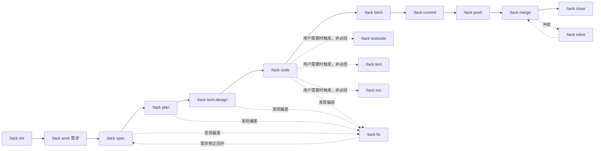

# [Tack Harness](https://github.com/frcoder-lh/tack-harness)

**精简克制・人类可读・任意配置** — 专为软件研发打造的编程工作流框架

[](https://github.com/frcoder-lh/tack-harness)


## 1. 简介

Tack Harness 是一套专为软件研发打造的编程工作流框架：

- 时间维度上遵循软件工程生命周期流转，空间维度上按照研发习惯组织目录结构；
- 封装了 Git 操作并支持 worktree，允许多个 agent 并行开发不同需求；
- 规范化 AI 开发流程，沉淀公共开发逻辑，集中共享上下文，降低 token 消耗。

因此，无论是小规模项目，还是大型项目，都能从中受益。

与将流程固化的现有 AI 编码工具不同，Tack Harness 采取以下设计原则：

| 原则 | 说明 |
| --- | --- |
| **流程可固定** | 凡可由脚本完成的操作均不依赖大模型，通过固定流程脚本保证稳定性并控制 token 成本 |
| **能力可扩展** | 新增一个 Markdown 文件即注册一条新能力，无需修改 skill 本体 |
| **状态可追踪** | 工作区 `status.yaml` 为唯一有状态文件，AI 可随时明确当前进度与下一步操作 |
| **改动可隔离** | 通过 worktree 隔离各需求的代码改动，主仓库始终保持只读基准 |
| **经验可沉淀** | 每个完成的任务自动将实践经验沉淀为命令、工作流、规则或 wiki 条目 |

核心特性：

| 特性 | 说明 |
| --- | --- |
| **依赖注入** | skill 为容器、能力为注入物：skill 本体极简，不含任何命令实现；命令、工作流、可委派角色均为项目内的 Markdown 文件，文件头（command/short/triggers/summary）即注入声明，`scan-routes` 运行时动态扫描并装配为路由表。新增一个文件即注入一条新能力，skill 零改动、升级不覆盖 |
| **工作流状态机** | 开发、测试、缺陷修复、冲突合并、分支操作各有独立工作流，定义状态流转并编排命令。工作区 `status.yaml` 的状态由工作流定义，AI 始终明确当前阶段与下一步 |
| **缺陷溯源** | bugfix 工作流内置 `git-bug-trace`：定位缺陷代码行后一键追溯引入 commit、时间、作者、对应需求/工单 ID 与合并到主干的 MR 链接（GitHub/GitLab/Bitbucket），结果落 `status.yaml` 的 `bug_origin`；区分需求引入与历史遗留，回溯 MR 审查结论与关联改动 |
| **审查与上线门禁** | `code-review` 以 plan/技术方案为规范、目标分支三点 diff 为事实逐函数审查改动正确性与危害、评估影响接口与场景，产出独立审查报告；`release-check` 产出上线检查清单——数据库变更语句、配置变更模板、接口权限申请、中间件资源申请，逐项打勾后发布 |
| **命令自创造** | `record` 为 "生成指令的指令"。首先扫描已有命令尝试融合修正；若无合适命令，仅需提供 `command`，其余内容自动生成 |
| **自进化** | guidance 闭环：任务各环节自动把用户的引导、纠偏、补充约定以原始事实追加到 `status.yaml` 的 `guidance` 列表（raw）；`close` 收尾时自动审查并固化到 workflow/cmd/rule（distilled），落点经 `check-guidance` 校验，形成「采集 → 固化 → 校验」的自进化回路 |
| **自动更新检查** | `close`/`evolution`/`record`/`help` 命令收尾时静默检查新版本（7 天 + 同版本双节流，不在会话开始时抢占任务）；发现新版本时展示本机版本到最新版本之间的全部更新内容，用户确认后说「更新」即可升级 |
| **角色委派** | `harness/agents/` 内置可委派角色（code-explorer / code-architect / code-reviewer），被 `ask`/`plan`/`merge` 等命令引用后经 Task 子代理在独立上下文并行执行；只供发现与委派，不参与命令路由 |
| **Hook 加速层** | `harness/script/hook/` 提供 IDE Hooks 可选加速（SessionStart 预载路由、UserPromptSubmit 零往返路由解析、PreToolUse 边界观察）；仅搬运确定性事实，AGENTS.md + `scan-routes.sh` 仍是唯一事实源，默认不启用、不拦截 |
| **向外学习** | `study` 把外部 skill 或仓库当作教材：通读结构、提炼可借鉴点、以新增/融合/优化方式落盘到 harness 对应位置，全程唯一确认点是统一预览，确认后自动提交并触发一次 `evolution` 向内自审 |
| **精简克制** | 保持最小目录结构、基础命令与必要状态流转；凡可脚本化的操作不依赖大模型 |
| **简单易用** | 所有命令支持中英文触发词与简写（如 `需求规划`/`spec`/`sp`） |
| **开放配置** | 全部命令、工作流、规则均位于项目 `harness/` 目录下，可自由增改，升级不覆盖 |
| **安全可控** | worktree 隔离改动、命令准入准出、人工审阅关口、禁用破坏性 Git 操作 |


## 目录

- [1. 简介](#1-简介)
- [2. 快速开始](#2-快速开始)
- [3. 安装](#3-安装)
- [4. 使用流程](#4-使用流程)
- [5. 工作流模型](#5-工作流模型)
- [6. 工作区结构](#6-工作区结构)
- [7. 命令参考](#7-命令参考)
- [8. 扩展机制](#8-扩展机制)
- [9. 安全模型](#9-安全模型)
- [10. 常见问题](#10-常见问题)
- [11. 贡献](#11-贡献)
- [12. 致谢](#12-致谢)
- [13. License](#13-license)


## 2. 快速开始

```bash
# 1. 安装（推荐由 agent 自行安装）
安装这个skill：https://github.com/frcoder-lh/tack-harness

# 2. 在空目录中初始化工作空间
/tack

# 3. 创建需求并完成规划与开发
/tack work 用户登录
/tack spec && /tack plan && /tack code
```

> ✅ 完成上述步骤即走通一条完整研发链路，全部命令见[命令参考](#7-命令参考)。


## 3. 安装

### 方式一：由 agent 自行安装（推荐）

在 TRAE 中输入：

```
安装这个skill：https://github.com/frcoder-lh/tack-harness
```

### 方式二：一键安装脚本

```bash
curl -fsSL https://raw.githubusercontent.com/frcoder-lh/tack-harness/master/install.sh | sh -s
```

> Windows Git Bash 下若报 `CRYPT_E_NO_REVOCATION_CHECK` 吊销检查错误（schannel 后端无法访问证书吊销服务），加 `--ssl-no-revoke` 即可：
> `curl -fsSL --ssl-no-revoke https://raw.githubusercontent.com/frcoder-lh/tack-harness/master/install.sh | sh -s`

### 方式三：克隆后安装

```bash
git clone git@github.com:frcoder-lh/tack-harness.git
cd tack-harness

sh install.sh                              # 交互式安装（推荐）
sh install.sh --agent trae                 # 安装到 TRAE
sh install.sh --list                       # 查看支持的所有 agent
sh install.sh --agent trae --dry-run       # 预览安装内容
```

> Windows 用户请在「Git Bash」终端中执行上述命令；或在 PowerShell 中执行：
> `& "C:\Program Files\Git\bin\bash.exe" install.sh --agent trae-cn`
> （TRAE 国内版用 `trae-cn`，国际版用 `trae`）

### 方式四：从 Releases 下载压缩包

无法使用 Git 克隆，或希望安装某个固定版本时，可从 [Releases 页面](https://github.com/frcoder-lh/tack-harness/releases)下载压缩包（如 `tack-harness-V0.0.1.zip`，包内为仓库根目录文件、无外层目录），解压后执行安装脚本：

```bash
mkdir tack-harness
unzip tack-harness-V0.0.1.zip -d tack-harness
cd tack-harness

sh install.sh
```

## 4. 使用流程

以下以 "用户登录" 需求为例，说明从空目录到需求上线的完整流程。

### 4.1 初始化项目空间

```
/tack
```

空目录将触发初始化：自动确保本机 Git 可用（缺失时按平台自动安装），tack 空间骨架完整复制至当前目录，并将该目录初始化为 Git 仓库、由框架自动完成首次提交；随后 `init` 引导用户以一句话描述项目（自动提炼项目名与关键词），并接入代码仓库 —— 本地已有仓库则扫描后软链，新仓库则填写 Git 地址克隆。项目信息记录于 `AGENTS.md` 的「项目信息」区块。

> **Git 双层边界**：空间根仓库（harness/、wiki/、AGENTS.md、space/ 工作文档）的 Git 操作全部由框架在各命令阶段自动提交，用户无需操作；用户只在 `space/<YYYYMMDD>-<branch>/repo/` 工作区代码仓库内执行提交、推送等 Git 操作。

初始化后的空间结构：

```
my-project/
├── AGENTS.md            # 常驻说明书：核心约束 + 项目信息（项目名/关键词/仓库映射/工作列表）
├── harness/             # 开发过程定义（需求无关，可自定义，升级不覆盖）
│   ├── README.md        #   harness 的使用说明
│   ├── cmd/             #   命令：发现、路由、准入准出
│   ├── agents/          #   可委派角色：独立上下文并行执行（explorer/architect/reviewer）
│   ├── workflow/        #   工作流：状态机与命令编排
│   ├── script/          #   固定流程脚本（init-tack 初始化 / scan-routes 路由扫描 / lint-harness 结构自检 / scan-secrets 凭据扫描 / check-guidance 落点校验 / work-status 状态回写 / space 空间自动提交 / project 项目信息 / repo 仓库 / work 工作区 / git-worktree-helper / git-bug-trace 缺陷溯源 / git-diff-context 三点 diff 导出 / branch-op 分支操作 / check-update 更新检查；Windows 统一经 run.ps1 启动器调用）
│   │   └── hook/        #   IDE Hook 可选加速层（SessionStart/UserPromptSubmit/PreToolUse，默认不启用、不拦截）
│   ├── rule/            #   业务、代码与安全规则（coding-standards、security、git-boundary 双层边界、context-loading 上下文加载、windows-env、record-* 沉淀规则；不参与路由，按需加载）
│   ├── template/        #   命令、工作流、文档、工作区模板
│   └── reference/       #   通用方法论与复杂独立能力（随 harness 分发、不接受项目沉淀；被命令/工作流/角色/规则引用后才加载）
├── wiki/                # 公共知识：业务背景、代码导航锚点（术语→入口、接口→场景）、服务清单与代码外事实、技术决策与工程约定（init/record/close 按需物化，条目带来源、矛盾保留演变；空目录起步，不记易变代码逻辑）
├── space/               # 工作空间：每个工作一个目录（<YYYYMMDD>-<分支名>，日期前缀便于按创建时间排序）
├── repo/                # 代码主仓库：只保留一份，只读基准
└── .tack/               # 框架本地运行时数据（gitignore，不入库、可随时清理）：log 日志 / backup 回滚备份 / tmp 临时文件 / state 本机状态
```

### 4.2 创建工作（需求）

```
/tack work 用户登录
```

`work` 根据目的生成英文分支名候选、自动推断涉及的关联服务（经用户确认后可增删），随后执行以下操作：

- 使用 git worktree 将涉及仓库检出至 `space/20261001-user-login/repo/<repo-name>/`（多个 agent 可并行开发不同需求，互不干扰；worktree 检出的分支名仍为 `user-login`）；
- 在 `space/20261001-user-login/` 生成扁平工作区：`status.yaml`（唯一有状态文件：属性 + 日志 + 待办）、`input.md`；
- 在 `AGENTS.md` 项目信息区块登记该工作。

用户可将 PRD 片段、参考链接写入 `space/20261001-user-login/input.md`，并可指定 AI 分析链路的入口。

### 4.3 需求分析（三段式，逐段人工确认）

```bash
/tack spec           # 需求规划（整体设计）：story 拆分、系统/模块、关系交互、边界、验收标准 → spec.md
/tack plan           # 开发计划：复杂任务先做多方案对比与选定，再产出详细设计 + 低耦合模块与任务清单 → plan.md + status.yaml 的 tasks 列表
/tack tech-design    # 技术评审文档：结合技术模板产出 → tech-design.md
```

分析过程检索 `wiki/` 公共知识；ask 提炼的稳定导航锚点（术语→检索词/代码入口、接口→业务场景）经人工审阅后由 record 沉淀至根 wiki，调用链等易变细节只留在工作区分析文档。`status.yaml` 随环节推进自动更新状态与进度。

### 4.4 开发、修正与测试

```bash
/tack code         # 先判定涉及仓库并确保就绪（缺仓库转 create-repo、缺 worktree 转 worktree），再按 tasks 依赖关系连续/并行开发：复用已有逻辑，多方案自动取最优解；用户明确要求时仅交付代码片段
/tack fix          # 需求修正走 spec→plan→代码；代码修正走代码→同步文档，保持文档与代码一致
/tack testcode     # （按需触发，非必经）单测驱动的需求-代码一致性审查：对照 spec/plan 核对代码实现、识别缺陷与边界遗漏，用例暴露问题后修代码而非改测试；覆盖率 90% 是准出指标之一
/tack test         # （按需触发，非必经）系统测试：把测试描述转化为 $work/test.md 可落地方案，需脚本时落到 run/
/tack run          # （按需触发，非必经）执行脚本：无 run/ 时初始化（run.md + local/），有 run.md 时按清单执行；敏感数据落 run/local/（gitignored）
```

`testcode` / `test` / `run` 均为**按需命令**：code 完成后可直接提交合并，AI 不主动询问"是否测试"；用户需要时直接触发（或以测试为目的时走 testing 工作流），不触发无需任何标记。

代码改动仅允许落在 `space/20261001-user-login/repo/` 的 worktree 内，主仓库 `repo/` 始终为只读基准。各环节加载上下文时先经 grep 定位再读取相关片段，避免整仓通读，以节约 token。

### 4.5 提交、合并与收尾

```bash
/tack fetch         # 拉取各仓库最新代码
/tack commit        # 自动生成 Conventional Commits 提交信息后直接提交（无需二次确认）
/tack push          # 推送，未关联远端时先引导关联
/tack merge         # 委派 reviewer 审查（三视角并行），审查结论三选一：修复/记录后续/维持现状；优先平台发起 MR/PR，冲突时 /tack solve 逐文件引导解决
/tack close         # 交付检查 → 输出交付摘要 → 提炼 wiki（含技术决策）→ 消费 guidance 自进化固化 → 移除 worktree → 状态置 completed
```

### 4.6 经验沉淀与复用

任务结束后，AI 自动调用 `/tack record` 沉淀经验：先扫描已有命令，可融合则融合修正；需新建命令时，仅需提供 `command`，简写、中英文触发词与命令正文自动生成 —— **扫描器即时识别，skill 无需任何改动**。

经验沉淀形成三条互补通路：

- **自动采集**：任务各环节凡用户对 AI 的做法有过引导、纠偏、补充约定，自动把原始事实追加到 `status.yaml` 的 `guidance` 列表（raw），`close` 时自动审查固化到 workflow/cmd/rule（distilled），落点由 `check-guidance.sh` 持续校验；
- **向内自审**：`/tack evolution` 定期审查全部指令文件，识别可沉淀为 rule/reference/script 的候选，经人工确认后落盘；
- **向外学习**：`/tack study <skill 名|本地路径|Git 链接>` 通读外部 skill 或仓库，提炼可借鉴点并以新增/融合/优化方式落盘到 harness，统一预览确认后自动提交并触发一次 evolution。


## 5. 工作流模型

工作流由「状态机 + 命令编排」构成。AGENTS 收到指令后，先确认当前工作，再识别意图所属工作流，并按状态流转引导命令：

| 工作流 | 触发词 | 状态流转 |
| --- | --- | --- |
| development | 开发工作流 /dev | `initialized → planning → developing → reviewing → merged → completed` |
| testing | 测试工作流 /tst | `initialized → test-planning → testing → verifying → completed` |
| bugfix | 改 bug /bugfix | `initialized → reproducing → diagnosing → fixing → verifying → completed` |
| merge-conflict | 合并冲突 /mc | `initialized → fetching → merging → resolving → verifying → pushing → completed` |
| branch-op | 分支操作 /bop | `initialized → preparing → integrating（冲突时 resolving）→ pushing → completed`，临时分支与 worktree 在 close 时清理 |

任意环节受阻可进入 `blocked` 状态（在 `status.yaml` 中记录阻塞原因），解除后回到原状态。开发主链路如下：



> `testcode` / `test` / `run` 是**按需命令**：不在主链路上占位，不阻塞提交与合并，AI 不在 code 完成后主动询问或引导；用户需要单测审查、系统测试或执行脚本时直接触发（或以测试为目的时走 testing 工作流），不触发无需任何"跳过"标记。


## 6. 工作区结构

`space/<YYYYMMDD>-<branch>/`（如 `space/20261001-user-login/`；目录名带创建日期前缀，按名排序即按创建时间排序，worktree 内 git 分支名不带日期）采用扁平结构：

| 文件 | 产生时机 | 作用 |
| --- | --- | --- |
| `status.yaml` | 创建工作区 | 属性 + 日志 + 待办：记录当前处理任务、进度与下一步；`guidance` 列表采集用户引导（raw）并在 close 时固化为 harness 条目（distilled）；唯一有状态文件，字段由 `work-status.sh` 确定性回写 |
| `input.md` | 创建工作区 | 原始需求、参考链接、需求理解、建议分析链路 |
| `spec.md` | `/tack spec` | 需求规划（整体设计）：施工图 + 验收合同 |
| `plan.md` | `/tack plan` | 开发计划（详细设计 + 任务清单）：编码落地细节与任务拆解 |
| `tech-design.md` | `/tack tech-design` | 技术评审文档 |
| `test.md` | `/tack test`（按需） | 系统测试方案（可落地、可执行）；与 testcode（单测/覆盖率）区分，面向完整系统功能验证 |
| `run/` | `/tack test` / `/tack run`（按需） | 测试/执行脚本与 `run.md` 执行说明；`run/local/` 存敏感数据（已被 .gitignore 忽略，不入版本库） |
| `wiki/` | `work` / `ask` | 工作区级代码分析文档（`<repo>-analysis.md`） |
| `repo/<name>/` | `work` | git worktree，唯一可写代码区 |


## 7. 命令参考

所有命令支持中英文触发词与简写，格式为 `/tack <命令|简写|触发词> [参数]`（在已激活 tack 的对话中亦可省略 `/tack` 前缀，直接输入命令或自然语言）。完整清单以 `/tack help` 的实时扫描结果为准。

### 7.1 项目空间命令（cmd/base/）

| 命令 | 简写 | 触发词 | 作用 |
| --- | --- | --- | --- |
| `init` | i | 初始化 /init | 提炼项目信息写入 AGENTS.md，扫描软链或克隆仓库 |
| `work` | w | 工作区 /work | 新建 / 重命名 / 切换 / 列出工作区，自动推断服务、创建 worktree |
| `help` | h | 帮助 /help | 扫描 harness，输出工作流与全部命令 |
| `update` | u | 更新 /update | 更新 harness 与空间根 .gitignore（.tack/ 强制兜底），保留自定义 cmd/rule 与 AGENTS.md |
| `create-repo` | cr | 新建仓库 /createrepo /create-repo | 新建并初始化本地代码仓库，纳入项目空间管理 |
| `record` | r | 记录 /record | 优先融合已有条目；可落命令 / 工作流 / 规则 / wiki / AGENTS.md 常驻约定，新建时仅需提供 command |
| `evolution` | evo | 进化 / 进化harness /evolution | 结构自检（lint-harness）并审查指令，提炼 rule/reference/script 候选，人工确认后落盘 |
| `study` | st | 学习 / 研习 / 借鉴 /study | 向外学习外部 skill 或仓库的设计，提炼可借鉴点并落盘到 harness 对应位置，统一预览确认后提交，随后自动执行一次 evolution |

### 7.2 需求开发命令（cmd/dev/）

| 命令 | 简写 | 触发词 | 作用 |
| --- | --- | --- | --- |
| `ask` | a | 问 / 提问 / 代码问答 / 分析代码 / 代码分析 /ask | 可选：分析 worktree 代码（可委派 explorer 并行勘探），在 `$work/wiki/` 产出分析文档或沉淀问答 |
| `spec` | sp | 需求规划 / 整体设计 /spec | 读 input.md + wiki（root/work）+ 代码事实，grep 定位后产出 spec.md |
| `plan` | p | 详细设计 / 开发计划 / 任务拆解 /plan | 复杂任务先多方案对比与选定，再拆低耦合模块与任务（写入 plan.md + status.yaml tasks），决策点前置关闭 |
| `tech-design` | td | 技术方案 / 技术评审 /tech-design | 产出技术评审文档 |
| `code` | c | 编码 /code | 编码前判定仓库就绪（缺仓库转 create-repo、缺 worktree 转 worktree）；按 tasks 依赖连续/并行开发；用户明确要求时支持仅交付代码片段 |
| `fix` | fx | 修正 / 需求修正 / 修正代码 /fix | 需求修正（spec→plan→代码）或代码修正（代码→同步文档），保持文档与代码一致 |
| `testcode` | tc | 单测 / 单元测试 /testcode | 按需触发，非必经：以单测为手段做需求-代码一致性审查与缺陷发现，对照 spec/plan 验收标准核对代码、识别边界遗漏，用例暴露问题后修代码而非改测试；覆盖率 90% 是准出指标之一 |
| `test` | t | 测试 / 系统测试 / 集成测试 /test | 按需触发，非必经：把测试描述转化为 `$work/test.md` 可落地方案；需脚本时落到 `run/` |
| `run` | rn | 运行 / 执行 / 跑脚本 /run | 按需触发，非必经：无 `run/` 时初始化（`run.md` + `local/`），有 `run.md` 时按清单执行；敏感数据落 `run/local/`（gitignored） |
| `code-review` | rv | 代码审查 / 审查报告 /code-review | 按需触发：以 plan/tech-design 为规范、目标分支三点 diff 为事实，逐函数分析改动、正确性与危害，评估影响接口与场景，产出 `$work/code-review.md` |
| `release-check` | rc | 上线检查 / 发布检查 /release-check | 按需触发：识别数据库变更（含变更语句）、配置变更（含模板）、新增接口调用（权限申请）、新增中间件（申请配置），产出 `$work/release-check.md` |
| `close` | cl | 关闭工作区 /close | 交付检查与摘要、提炼 wiki（含技术决策）、消费 guidance 自进化固化 harness 并校验落点、移除 worktree、状态收尾 |

### 7.3 Git 命令（cmd/git/）

| 命令 | 简写 | 触发词 | 作用 |
| --- | --- | --- | --- |
| `fetch` | f | 拉取 /fetch | 拉取各仓库最新代码（仅 fetch，不 merge） |
| `worktree` | wt | 工作树 /worktree | 为指定仓库补建 worktree |
| `commit` | ci | 提交 /commit | 本地提交，非 git 目录先 init；提交信息自动生成后直接提交，无需二次确认 |
| `push` | ps | 推送 /push | 推送远端，未关联时引导关联 |
| `merge` | m | 合并 /merge | 委派 reviewer 审查并三选一分流，平台 MR/PR 或本地合并，冲突转 solve |
| `solve` | s | 冲突 / 解决冲突 /solve | 引导式逐文件解决冲突 |


## 8. 扩展机制

工作流与命令均为 Markdown 文件，文件头声明路由信息：

```yaml
---
command: spec          # 工作流文件用 workflow: development
short: sp
triggers: 需求规划, 整体设计, spec
summary: 产出需求规划文档
---
```

扫描器一次性扫描工作流与命令：

```bash
sh harness/script/scan-routes.sh list      harness   # 工作流表 + 命令表 + 可委派角色表
sh harness/script/scan-routes.sh workflows harness   # 仅工作流（意图识别）
sh harness/script/scan-routes.sh commands  harness   # 仅命令
sh harness/script/scan-routes.sh agents    harness   # 仅可委派角色（agents/ 不参与 resolve）
sh harness/script/scan-routes.sh resolve   harness 需求规划
sh harness/script/lint-harness.sh          harness   # 结构自检：frontmatter/四段/路由冲突/reference 孤儿
```

扩展规则：

- 新增 Markdown 文件即注册新能力，即时生效；脚手架位于 `harness/template/cmd.md` 与 `workflow.md`；
- `_` 开头的文件不参与路由；支持新建自定义命令分组；
- `record` 可交互式融合或生成新命令、新工作流。

### 8.1 IDE Hook 可选加速层

`harness/script/hook/` 提供 TRAE / Claude Code 的 Hooks 集成，作为**可选加速层**而非控制流本身：事实源与判断权仍在 `AGENTS.md` + `scan-routes.sh`，Hook 只搬运确定性事实。初始化空间时自动生成 `.trae/hooks.json` 与 `.claude/settings.json`，需在 IDE「设置 > Hooks」中手动启用后才生效。

| 事件 | 作用 | 对会话影响 |
| --- | --- | --- |
| SessionStart | 预注入路由全表、`$root`/`$work` 路径与工作区快照（cwd 在工作区内则精确命中，否则取最近活跃并提示确认）；不写入任何路径类环境变量 | 省去首轮 `scan-routes list` 往返 |
| UserPromptSubmit | 以当次 cwd 实时解析空间根与工作区（cwd 在 `space/<name>/` 内精确命中，天然支持多项目窗口与同空间多工作区并行；之外回退最近活跃）；对用户输入执行 `scan-routes resolve`：唯一命中直接注入 cmd/workflow 正文与状态快照，多命中列候选，无命中给全表 | 省去路由解析往返与重复的空间/工作区扫描 |
| PreToolUse | 观察模式（默认）：命令执行类工具（RunCommand/Bash）的调用与 Git 双层边界、`--force`/`--no-verify` 等规则命中经统一日志记录；`TACK_HOOK_ENFORCE=1` 才输出 deny（**当前预留，默认不拦截**） | 默认零输出、零拦截 |

统一日志：设置环境变量 `TACK_HOOK_LOG=1` 后，三个 Hook 每次被调用都会把完整记录（时间、事件、pid、`$root`/`$work`、输入 payload、注入/拦截输出、退出码与耗时）追加到 `$root/.tack/log/hook.log`，并发调用按整块串行写入、互不交错；默认关闭，关闭时 Hook 输出逐字节不变。

降级：删除空间根下的 `.trae/` 与 `.claude/` 目录即完全回退到「AI 主动调用 `scan-routes.sh`」的原有路径，框架能力不受影响。


## 9. 安全模型

| 机制 | 说明 |
| --- | --- |
| **worktree 隔离** | 代码改动仅限工作区 worktree，主仓库 `repo/` 只读 |
| **Git 双层边界** | 空间根仓库由框架自动提交托管（`space.sh`），用户不直接操作；用户 Git 命令仅作用于工作区代码仓库 |
| **命令准入准出** | 破坏性 Git 操作被禁用，命令执行受准入准出约束 |
| **人工审阅关口** | 分析结论、合并均需人工确认后方可生效；提交由用户主动发起 commit 命令触发（发起即确认意图，信息自动生成后直接提交） |
| **凭据明文拦截** | `scan-secrets.sh` 在空间文档（wiki/、space/）提交前做高置信凭据扫描，命中即阻断自动提交；支持 `tack:allow-secret` 豁免标记与占位值过滤 |
| **落点证据链校验** | `check-guidance.sh` 校验 guidance distilled 条目的落点文件仍然存在，失效即阻断 close，防止固化证据链悬空 |
| **Hook 边界观察层** | `PreToolUse` Hook 观察 Git 双层边界、`--force`/`--no-verify` 等破坏性操作；默认仅记录不拦截，调用与命中详情随 `TACK_HOOK_LOG=1` 统一写入 `$root/.tack/log/hook.log`（三个 Hook 事件共用）；`TACK_HOOK_ENFORCE=1` 预留 deny 路径，启用前须先用日志校准误判 |


## 10. 常见问题

**Q：如何添加自定义命令或工作流？**

复制 `harness/template/cmd.md`（命令）或 `workflow.md`（工作流）至对应目录，修改文件名并补充文件头，扫描器即时识别；亦可直接调用 `/tack record`，该命令会先尝试与已有命令融合，新建时仅需提供 command。

**Q：`update` 会覆盖我的自定义内容吗？**

不会。`update` 仅刷新 `script/`、`template/`、`reference/`、`workflow/`；`cmd/` 只增补、不覆盖同名文件；`rule/` 与 `AGENTS.md`（含项目信息区块）完全保留。

**Q：支持多仓库项目吗？**

支持。`work` 按目的推断涉及服务，每个仓库独立 worktree 至 `space/<YYYYMMDD>-<branch>/repo/<repo-name>`，Git 命令逐仓库执行。

**Q：为什么项目信息放在 AGENTS.md 而不是独立配置文件？**

为精简文件数量。项目名、关键词、服务仓库映射、工作列表均位于 AGENTS.md 尾部的「项目信息」YAML 区块，由 `harness/script/project.sh` 维护（带边界标记，区块外内容不受影响）。

**Q：Windows 上脚本能跑吗？**

脚本为 POSIX sh，Windows 统一经 `run.ps1` 启动器调用（自动定位 Git for Windows 的 bash.exe，未安装时首次运行自动通过 winget 安装）；不支持软链时可采用克隆方式接入仓库。Git Bash 中的 curl 若报 `CRYPT_E_NO_REVOCATION_CHECK`（schannel 证书吊销检查失败），在 curl 后加 `--ssl-no-revoke`，或改用方式三克隆安装。

**Q：`record` / `evolution` / `study` 三个"进化"类命令如何分工？**

`record` 沉淀用户明确给出的内容或 guidance 条目（人给素材）；`evolution` 向内自审，从现有 cmd 中提炼 rule/reference/script（无外部素材）；`study` 向外学习第三方 skill/仓库，借鉴其流程、命令、规则、脚本、模板与组织方式。

**Q：从旧版目录结构（work/、doc/、根 status.yaml）如何迁移？**

① 创建 `space/`，将 `work/<branch>` 迁移至 `space/<YYYYMMDD>-<branch>`（为目录补创建日期前缀，如 `20261001-user-login`），并将文档扁平放置（`doc/tech-design.md` → `tech-design.md`）；② 对每个仓库执行 `git worktree repair` 修复路径；③ 将根 `status.yaml` 内容并入 `AGENTS.md` 项目信息区块（可先执行 `harness/script/project.sh ensure <root>` 生成区块）；④ 更新 harness 后以 `scan-routes.sh list harness` 验证。


## 11. 贡献

欢迎提交新命令、新工作流、文档修正及 issue 反馈。

- 提交问题与建议：[GitHub Issues](https://github.com/frcoder-lh/tack-harness/issues)
- 参考现有命令模板：`harness/template/cmd.md`、`workflow.md`


## 12. 致谢

部分研发方法论（harness/reference/）参考 [Matt Pocock 的 skills 仓库](https://github.com/mattpocock/skills) 翻译变体而来。

角色并行委派、方案对比门禁、审查分级与结构自检等设计，借鉴了 [anthropics/claude-code](https://github.com/anthropics/claude-code) 官方插件（feature-dev、code-review）与 Agent Skills/Subagents 文档中的工程实践。

记忆系统借鉴了 [hindsight](https://github.com/vectorize-io/hindsight)。


## 13. License

[MIT License](LICENSE) © frcoder-lh
